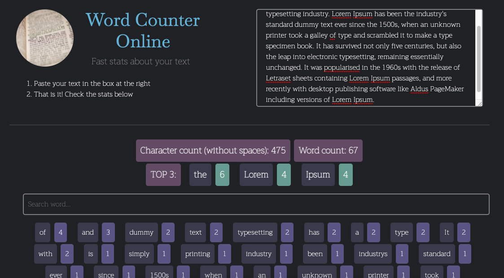

### MIT Lab Week 11

# Name

Online Word Counter - MIT Lab Week 11

# Description

This project is supposed to be challenging and useful for people learning javascript.  

Yet another online word counter, right? Well, yes. I always wondered how much code it was needed for this type of online applications, and this is it!

Do you have any request to make it even more useful? Contact me using one of the links below.

It was build using plain javascript.
It uses Bootstrap as a starting point for styles.

  
Live preview: https://renzodupont.github.io/mit-career-2021/week-11/

# Contact info

📫 https://www.linkedin.com/in/renzo-dupont-b9797941/ | https://twitter.com/renzodupont | https://instagram.com/renzodupont

# License information

MIT Licensed
